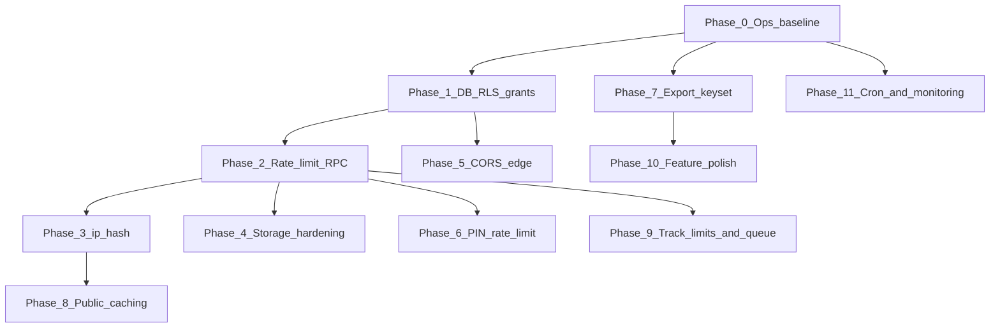

# SANAD — Risk Remediation Playbook

**Purpose:** Step-by-step fix plan for all **RED** and **YELLOW** risks identified in the platform readiness audit.  
**Audience:** Engineers and AI agents starting a **new chat session**.  
**Rule:** Complete **one step at a time**. Do not batch unrelated steps. Do not skip verification.

**Companion docs (read for context, do not duplicate work blindly):**
- [`current situation.md`](./current%20situation.md) — live feature/route inventory
- [`updates.md`](./updates.md) — latest shipped changes
- [`role.md`](./role.md) — coding conventions (verify “open” items against this playbook first)
- [`prd-v2-scoring-queue-ops.md`](./prd-v2-scoring-queue-ops.md) — v2 spec reference

**Supabase project:** `lpdjtzwfxsjjudhxinmk`  
**Last playbook update:** 2026-06-06 (Step 2.1 — check_rate_limit RPC)

---

## Instructions for AI agents (mandatory)

1. **Read this entire file** before writing any code.
2. Find the **first step** with status `⬜ NOT STARTED` whose prerequisites are all `✅ DONE`.
3. Execute **only that step** in the current session unless the user explicitly asks for more.
4. **Read every file listed** in “Files to read first” before editing.
5. **Do not invent** new tables, RPCs, or env vars unless this playbook names them.
6. **Do not refactor** unrelated code, change UI design, or remove working features.
7. After each step: run verification commands, update the step status in this file to `✅ DONE`, and note the date.
8. If blocked (missing Supabase CLI access, secrets, migration apply): mark `⚠️ BLOCKED`, document why, **stop**, and ask the human operator.
9. New migrations must use timestamp prefix `20260607HHMMSS_` (or next available day) and live in `supabase/migrations/`.
10. Prefer **extending existing libs** (`submissions-list.ts`, `export-submissions.ts`, edge functions) over parallel abstractions.

### Standard verification after any code step

```bash
npm run test
npm run build
npm run smoke:ship   # requires .env with anon key
```

---

## Risk registry

### RED — fix before high-traffic launch

| ID | Risk | Current state | Primary files |
|----|------|---------------|---------------|
| **SEC-R01** | Generic rate limiting unused | `rate_limit_log` table + index exist; **no app logic uses it** | `supabase/migrations/20260603110303_*.sql` |
| **SEC-R02** | Submission `ip_hash` always null | IP cluster fraud signal inactive | `src/routes/index.tsx`, scoring migrations |
| **SEC-R03** | Storage uploads too permissive | Anyone can INSERT to `id-docs` / `payment-proofs`; no size/MIME RLS | `supabase/migrations/20260602093529_*.sql` |
| **SEC-R04** | `queue_position` over-exposed | Any `authenticated` user can query any request UUID | `supabase/migrations/20260606020000_*.sql` |
| **SEC-R05** | `donation_proof_photos` no RLS | Table created without grants/RLS | `supabase/migrations/20260606090000_*.sql` |
| **SEC-R06** | CORS `*` on edge functions | All 4 functions allow any origin | `supabase/functions/*/index.ts` |
| **SEC-R07** | QR PIN brute-forceable | 4-digit PIN; client-side compare; no attempt limit | `src/lib/distribution.ts`, `20260605180000_*.sql` |
| **OPS-R01** | `types.ts` out of sync | `npm run types:gen` may fail (CLI 403) | `src/integrations/supabase/types.ts` |
| **OPS-R02** | Edge functions deploy gap | Repo has 4 functions; prod may lag | `package.json`, `supabase/functions/` |
| **OPS-R03** | Migration parity unknown | Environments may miss `070000`–`091000` | `supabase/migrations/` |
| **OPS-R04** | Integrity cron not scheduled | `queue-integrity-check` exists; no schedule | `supabase/functions/queue-integrity-check/` |

### YELLOW — fix before scale / polish

| ID | Risk | Current state | Primary files |
|----|------|---------------|---------------|
| **PERF-Y01** | Async export uses offset batches | `advance_export_job` passes `offset` cursor to `list_submissions` | `20260606080000_*.sql` |
| **PERF-Y02** | No HTTP caching for public reads | Stats/ledger refetched every page load | `src/lib/donations.ts`, `src/routes/index.tsx`, `donate.tsx` |
| **PERF-Y03** | Realtime gaps | List/overview have channels; queue + detail do not | `admin.queue.tsx`, `admin.requests.$id.tsx` |
| **PERF-Y04** | Donate page asset weight | ~30 bundled JPEGs (~8–15 MB) | `src/lib/donate-photos.ts`, `DonationJourney.tsx` |
| **FEAT-Y01** | Extended export columns missing | 17 core columns only | `export_submissions_csv`, `ExportSubmissionsModal.tsx` |
| **FEAT-Y02** | Public queue position not on `/track` | `queue_position` RPC exists but not wired for applicants | `src/routes/track.tsx` |
| **FEAT-Y03** | `claim_first_admin` race | First login wins admin if `user_roles` empty | `20260602092558_*.sql` |
| **SEC-Y01** | `track_request` no rate limit | Public RPC; code+phone required but enumerable | `track_request` RPC, `track.tsx` |
| **SEC-Y02** | Donation submit no rate limit | Pledge insert unrestricted beyond RLS | `src/routes/donate.tsx`, `donations.ts` |
| **OPS-Y01** | Twilio secrets for prod SMS | Dev uses `OTP_DEV_LOG` | `send-otp` edge function secrets |

---

## Execution order (dependency graph)



**Never start Phase 2 before Phase 1** (RLS/grants must be correct before adding rate-limit RPCs callable from anon).

---

## Phase 0 — Ops baseline (no application code)

### Step 0.1 — Confirm migration parity

| Field | Value |
|-------|-------|
| **Status** | ✅ DONE |
| **Fixes** | OPS-R03 |
| **Prerequisites** | None |
| **Human required** | Yes — Supabase SQL editor or CLI |
| **Verified** | 2026-06-06 — operator confirmed prod apply 2026-06-06 |

**Goal:** Every environment (local linked project, staging, production) has the same migrations applied.

**Canonical apply order (all 27 files):**

1. `20260602092558_fa76c3b4-00de-47b1-b03d-34f66bd67de9.sql` — base schema, RLS, core RPCs
2. `20260602093529_201b4047-7505-4af0-90ae-36fda498a3ed.sql` — storage policies
3. `20260603110303_52487033-78f2-4ce9-a89f-c5b6623be040.sql` — fraud, OTP, rate_limit_log
4. `20260603110851_91b0f28e-37d5-49db-ba92-9b7f48f90d75.sql` — RLS hardening
5. `20260603110912_46237654-c976-4beb-b5f2-7e37e9517021.sql`
6. `20260605130000_submission_references.sql`
7. `20260605140000_soften_device_fingerprint_scoring.sql`
8. `20260605150000_track_request_history.sql`
9. `20260605160000_admin_detail_actions.sql`
10. `20260605170000_mukhtar_whitelist_extensions.sql`
11. `20260605180000_distribution_qr_pin.sql`
12. `20260605200000_admin_users.sql`
13. `20260605210000_donation_backend.sql`
14. `20260606000000_queue_number.sql`
15. `20260606010000_urgency_v2_scoring.sql`
16. `20260606020000_submissions_rpc_export.sql`
17. `20260606030000_list_submissions_advanced_filters.sql`
18. `20260606040000_queue_integrity_check.sql`
19. `20260606050000_scoring_config_runtime.sql`
20. `20260606060000_field_edit_scoring_trigger.sql`
21. `20260606070000_list_submissions_ops_filters.sql`
22. `20260606080000_export_jobs_async.sql`
23. `20260606090000_donation_proof_photos.sql`
24. `20260606091000_donation_impact_stats_extended.sql`

**Verify:**

```bash
npm run smoke:ship
```

Expect all v2 RPC names reachable. Document result in operator notes.

**Do NOT:** Re-run migrations that drop data without human approval.

**Operator notes (2026-06-06):**

| Check | Result |
|-------|--------|
| Repo migration count | **24** files in `supabase/migrations/` (canonical list below matches) |
| `npm run smoke:ship` | **FAILED** — 3 RPC(s) missing on `lpdjtzwfxsjjudhxinmk` |
| Supabase CLI link | **FAILED** — logged-in account lacks privileges for project `lpdjtzwfxsjjudhxinmk` |

**Missing on production (apply `20260606080000_export_jobs_async.sql`):**

- `get_export_job` — RPC NOT FOUND
- `advance_export_job` — RPC NOT FOUND
- `fetch_export_job_csv` — RPC NOT FOUND

Note: `create_export_job` from the same migration **does** exist (partial apply or manual run). Re-applying the full `20260606080000` file via Dashboard → SQL editor is safe (`CREATE OR REPLACE` / `IF NOT EXISTS`).

**Warnings (not blocking smoke, fix in later steps):**

- `queue_position` returned 200 without staff auth (SEC-R04 — Step 1.2)
- `get_active_scoring_config` returned 200 without staff auth

**Human unblock checklist:**

1. Supabase Dashboard → SQL editor → paste/run `supabase/migrations/20260606080000_export_jobs_async.sql`
2. Confirm `20260606090000` and `20260606091000` applied if not already (public `donation_impact_stats` OK)
3. Re-run `npm run smoke:ship` — expect exit 0, “All v2 RPCs reachable”
4. Mark Step 0.1 ✅ DONE in progress tracker

---

### Step 0.2 — Deploy edge functions

| Field | Value |
|-------|-------|
| **Status** | ✅ DONE |
| **Fixes** | OPS-R02 |
| **Prerequisites** | Step 0.1 |
| **Human required** | Yes — Supabase CLI login |
| **Completed** | 2026-06-06 — operator confirmed all edge functions deployed |

**Goal:** Production has all four edge functions deployed.

**Commands:**

```bash
npm run functions:deploy
# or individually:
npm run functions:deploy:otp
npm run functions:deploy:admin-users
npm run functions:deploy:export-job-url
npm run functions:deploy:queue-integrity-check
```

**Secrets to set in Supabase Dashboard → Edge Functions → Secrets:**

| Secret | Functions | Notes |
|--------|-----------|-------|
| `TWILIO_ACCOUNT_SID`, `TWILIO_AUTH_TOKEN`, `TWILIO_FROM` | `send-otp` | Fixes OPS-Y01 |
| `OTP_DEV_LOG=true` | `send-otp` | Dev/staging only |
| `SCHEDULED_FUNCTION_SECRET` | `queue-integrity-check` | Random 32+ char string; needed for Step 11.1 |
| `ALLOWED_ORIGINS` | All edge functions | Comma-separated: prod URL + `http://localhost:5173` (Step 5.1) |

**Verify:** Invoke `send-otp` with test phone in staging; invoke `queue-integrity-check` with admin JWT.

**Do NOT:** Put service role key in client `.env`.

---

### Step 0.3 — Regenerate or manually sync `types.ts`

| Field | Value |
|-------|-------|
| **Status** | ✅ DONE |
| **Fixes** | OPS-R01 |
| **Prerequisites** | Step 0.1 |
| **Human required** | Maybe — if CLI 403 persists |
| **Completed** | 2026-06-06 — manual sync from migrations (CLI 403) |

**Goal:** `src/integrations/supabase/types.ts` reflects live schema including `donation_proof_photos`, `export_jobs`, v2 columns.

**Try:**

```bash
npm run types:gen
```

**If 403:** Manually add missing table/RPC types by copying shapes from migrations — only add types for tables this project uses; do not rewrite the entire file.

**Verify:** `npm run build` passes with no type errors.

---

## Phase 1 — Database RLS and grants

### Step 1.1 — Lock down `donation_proof_photos`

| Field | Value |
|-------|-------|
| **Status** | ✅ DONE |
| **Fixes** | SEC-R05 |
| **Prerequisites** | Step 0.1 |
| **Human required** | Migration apply |
| **Completed** | 2026-06-06 |

**Files to read first:**

- `supabase/migrations/20260606090000_donation_proof_photos.sql`
- `src/lib/donations.ts` (note: gallery may now use static assets in `donate-photos.ts` — table still needs RLS if queried)

**Goal:** Public read-only access to proof metadata; only service role/admin can mutate.

**Create migration** `20260607XXXXXX_donation_proof_photos_rls.sql`:

1. `ALTER TABLE public.donation_proof_photos ENABLE ROW LEVEL SECURITY;`
2. `GRANT SELECT ON public.donation_proof_photos TO anon, authenticated;`
3. Policy `"public read donation proof photos"` — `SELECT` for `anon, authenticated` using `true`.
4. Policy `"admins manage donation proof photos"` — `ALL` for `authenticated` where `has_role(auth.uid(), 'admin')`.
5. Revoke direct INSERT/UPDATE/DELETE from `anon`.

**Verify:**

- Anon client can `select` rows.
- Anon client cannot `insert`.
- `npm run test` && `npm run build`.

**Do NOT:** Drop the table (seed data may still be useful).

**Shipped (2026-06-06):** Migration `20260607110000_donation_proof_photos_rls.sql` — public SELECT; admin ALL via `has_role`; REVOKE mutate from `anon`. Apply on prod with Step 0.1 backlog.

---

### Step 1.2 — Restrict `queue_position` to staff

| Field | Value |
|-------|-------|
| **Status** | ✅ DONE |
| **Fixes** | SEC-R04 |
| **Prerequisites** | Step 0.1 |
| **Completed** | 2026-06-06 |

**Files to read first:**

- `supabase/migrations/20260606020000_submissions_rpc_export.sql` (function `queue_position`)
- `src/lib/` — grep for `queue_position` usage

**Goal:** Only staff can call `queue_position` directly. Applicants will get queue info via a new scoped RPC in Phase 9.

**Create migration** `20260607XXXXXX_queue_position_staff_only.sql`:

1. `REVOKE EXECUTE ON FUNCTION public.queue_position(UUID) FROM authenticated;`
2. Add at start of function body: `IF NOT public.is_staff(auth.uid()) THEN RAISE EXCEPTION 'not authorized'; END IF;`
3. `GRANT EXECUTE ON FUNCTION public.queue_position(UUID) TO authenticated;` (staff check is inside)

**Verify:**

- Signed-in staff can still call RPC from admin tools.
- Non-staff authenticated user gets `not authorized`.
- Add/update integration test if RPC tests exist.

**Do NOT:** Remove the function — admin queue UI may depend on it.

**Shipped (2026-06-06):** Migration `20260607120000_queue_position_staff_only.sql` — `is_staff` guard at function entry. Test added in `queue.integration.test.ts`. Apply on prod with Step 0.1 backlog; smoke should show auth guard OK for `queue_position`.

---

### Step 1.3 — Harden `claim_first_admin` (optional race fix)

| Field | Value |
|-------|-------|
| **Status** | ⬜ NOT STARTED |
| **Fixes** | FEAT-Y03 |
| **Prerequisites** | Step 0.1 |
| **Priority** | Low — do after RED items |

**Files to read first:**

- `supabase/migrations/20260602092558_*.sql` — `claim_first_admin`
- `src/contexts/AuthContext.tsx`

**Goal:** Prevent two simultaneous first logins both becoming admin.

**Create migration:**

1. Wrap insert in transaction with `SELECT ... FOR UPDATE` on a singleton config row **OR** use `INSERT ... ON CONFLICT` on a `bootstrap_lock` table.
2. Simplest safe approach: add table `admin_bootstrap (id int primary key default 1, claimed_at timestamptz, claimed_by uuid)` with single row; use advisory lock `pg_advisory_xact_lock(987654)` inside function before check.

**Verify:** Unit test or manual: two concurrent calls — only one returns true.

---

## Phase 2 — Rate limiting infrastructure

### Step 2.1 — Create shared `check_rate_limit` RPC

| Field | Value |
|-------|-------|
| **Status** | ✅ DONE |
| **Fixes** | SEC-R01 (foundation) |
| **Prerequisites** | Step 1.1 |
| **Completed** | 2026-06-06 |

**Files to read first:**

- `supabase/migrations/20260603110303_*.sql` — `rate_limit_log` schema + `idx_rate_ident`
- `supabase/functions/send-otp/index.ts` — existing OTP rate pattern (reference only)

**Goal:** One reusable RPC for edge functions and SECURITY DEFINER endpoints.

**Create migration** `20260607XXXXXX_rate_limit_rpc.sql`:

```sql
-- Pseudocode contract — implement exactly in migration:
-- check_rate_limit(_identifier text, _action text, _max_count int, _window_seconds int)
-- RETURNS jsonb { allowed: boolean, remaining: int, retry_after_seconds: int }
-- Logic:
--   1. COUNT rows in rate_limit_log WHERE identifier, action, created_at > now() - window
--   2. If count >= max: return allowed=false
--   3. Else INSERT log row (is_blocked=false) and return allowed=true
-- SECURITY DEFINER; SET search_path = public
-- GRANT EXECUTE TO service_role only (not anon)
```

Also create **`log_rate_limit_block`** helper for audit when blocked (optional insert with `is_blocked=true`).

**Important:** Revoke broad INSERT on `rate_limit_log` from anon if Step 2.1 moves all writes through RPC — update policy from migration `20260603110851` accordingly.

**Verify:**

- SQL test: 4th call within window returns `allowed=false`.
- Vitest integration test in `src/lib/__tests__/rate-limit.integration.test.ts` (create file).

**Do NOT:** Call this from client-side JS with anon key — **service role or edge function only**.

**Shipped (2026-06-06):** Migration `20260607130000_rate_limit_rpc.sql`; `src/lib/rate-limit.ts`; `rate-limit.integration.test.ts`. Revoked direct INSERT on `rate_limit_log` from anon/authenticated.

---

### Step 2.2 — Wire rate limits to `track_request` and `track_request_history`

| Field | Value |
|-------|-------|
| **Status** | ✅ DONE |
| **Fixes** | SEC-Y01 |
| **Prerequisites** | Step 2.1 |

**Approach:** Option A — `track-request-proxy` edge function with `check_rate_limit` (30/hr IP, 10/hr phone).

**Files to read first:**

- `supabase/migrations/20260602092558_*.sql` — `track_request`
- `supabase/migrations/20260605150000_track_request_history.sql`
- `src/routes/track.tsx`

**Goal:** Limit tracking lookups by IP hash (e.g. 30/hour/IP).

**Approach (choose one — document choice in commit):**

- **Option A (preferred):** New edge function `track-request-proxy` that checks rate limit then calls RPC with service role.
- **Option B:** Add rate check inside `track_request` RPC using `ip_hash` passed as parameter from a thin edge wrapper (do not trust client-supplied IP without edge function).

**Suggested limits:**

| Action | Identifier | Max | Window |
|--------|------------|-----|--------|
| `track_lookup` | `ip_hash` | 30 | 3600s |
| `track_lookup` | `phone_normalized` | 10 | 3600s |

**Verify:** 31st request in test returns 429 or Arabic error message.

**Do NOT:** Change track UX design.

---

### Step 2.3 — Wire rate limits to donation pledge submit

| Field | Value |
|-------|-------|
| **Status** | ✅ DONE |
| **Fixes** | SEC-Y02 |
| **Prerequisites** | Step 2.1 |

**Approach:** Edge function `submit-donation` with `check_rate_limit` (10/hr IP, 5/hr phone if provided).

**Files to read first:**

- `src/lib/donations.ts` — `submitDonation`
- `src/routes/donate.tsx`
- `supabase/migrations/20260605210000_donation_backend.sql`

**Goal:** Prevent donation spam (e.g. 10 pledges/hour/IP).

**Approach:** Edge function wrapper `submit-donation` OR serverFn with service role rate check before insert.

**Suggested limits:** 10/hour per IP hash, 5/hour per phone if provided.

**Verify:** Integration test; 11th pledge rejected with user-friendly Arabic message.

---

## Phase 3 — Submission IP capture (`ip_hash`)

### Step 3.1 — Capture IP on aid request submit

| Field | Value |
|-------|-------|
| **Status** | ✅ DONE |
| **Fixes** | SEC-R02 |
| **Prerequisites** | Step 2.1 |

**Approach:** Edge function `submit-aid-request` — hashes `x-forwarded-for` (same as send-otp), verifies OTP, inserts via service_role with `ip_hash`.

**Files to read first:**

- `src/routes/index.tsx` — insert payload (~line 460)
- `supabase/functions/send-otp/index.ts` — `hashIdentifier` function (mirror logic)
- Scoring migrations using `ip_hash` cluster check

**Goal:** Populate `aid_requests.ip_hash` on submit so fraud scoring signal activates.

**Approach (preferred):**

1. Create edge function `submit-aid-request` OR extend existing server path:
   - Read `x-forwarded-for` from request headers.
   - Hash with same algorithm as OTP (`hashIdentifier` in send-otp).
   - Insert row via service role **or** pass hash to RPC `submit_aid_request` that validates OTP was verified for phone.
2. **Do not** trust client-provided IP string from browser.

**Alternative smaller scope:** Postgres RPC `set_request_ip_hash(request_id, hash)` called from edge function immediately after client insert — but only if insert moves server-side.

**Verify:**

- New submission has non-null `ip_hash` in DB.
- Scoring applies IP cluster penalty when ≥4 same hash in 1 hour (see scoring migration).
- `npm run test`.

**Do NOT:** Store raw IP in `aid_requests` — hash only (column is `ip_hash`).

---

## Phase 4 — Storage hardening

### Step 4.1 — Tighten storage INSERT policies

| Field | Value |
|-------|-------|
| **Status** | ✅ DONE |
| **Fixes** | SEC-R03 |
| **Prerequisites** | Step 2.1 |

**Approach:** Block direct public INSERT on `id-docs` / `payment-proofs`; `upload-id-doc` edge function (5/hr IP) enforces path/MIME/5MB.

**Files to read first:**

- `supabase/migrations/20260602093529_*.sql`
- `supabase/migrations/20260603110851_*.sql` — file insert time windows
- `src/routes/index.tsx` — upload path `${data.id}/id.${ext}`

**Goal:** Reduce storage abuse while keeping public form uploads working.

**Create migration** `20260607XXXXXX_storage_upload_hardening.sql`:

1. **Path constraint:** INSERT only if `(storage.foldername(name))[1]` matches UUID pattern and exists in `aid_request_files` pending row **OR** matches donation proof flow path pattern.
2. **MIME allowlist:** `application/pdf`, `image/jpeg`, `image/png`, `image/webp` via `metadata->>'mimetype'`.
3. **Size limit:** `octet_length` / metadata size ≤ 5MB (adjust via human if needed).

**Also add rate limit** via edge function for upload if direct client upload remains (Step 2.1 infrastructure): 5 uploads/hour/IP.

**Verify:**

- Valid ID doc upload from form still works.
- Upload of `.exe` or 20MB file rejected.
- Upload to random path rejected.

**Do NOT:** Break existing files already in bucket.

---

## Phase 5 — Edge function CORS

### Step 5.1 — Restrict CORS origins

| Field | Value |
|-------|-------|
| **Status** | ✅ DONE |
| **Fixes** | SEC-R06 |
| **Prerequisites** | Step 0.2 |

**Approach:** Shared `supabase/functions/_shared/cors.ts` + `ALLOWED_ORIGINS` env (comma-separated).

**Files to read first:**

- All four `supabase/functions/*/index.ts`
- Production domain (ask human if unknown)

**Goal:** Replace `Access-Control-Allow-Origin: *` with allowlist.

**Implementation:**

1. Add env var `ALLOWED_ORIGINS` (comma-separated): e.g. `https://sanad.example.org,http://localhost:5173`
2. Shared helper `corsHeaders(req)` returns matching origin or first allowed origin.
3. Apply to all four functions.

**Verify:**

- Preflight from production origin succeeds.
- Random origin gets no CORS header or 403 on POST.

**Do NOT:** Block Supabase dashboard scheduled invocations (cron uses secret header, not browser CORS).

---

## Phase 6 — QR PIN rate limiting

### Step 6.1 — Add PIN attempt tracking and lockout

| Field | Value |
|-------|-------|
| **Status** | ✅ DONE |
| **Fixes** | SEC-R07 |
| **Prerequisites** | Step 2.1 |

**Approach:** `pin_attempt_log` + `verify_distribution_pin` RPC (5 failures/15min/request, 20/hr/staff).

**Files to read first:**

- `src/lib/distribution.ts` — `completeDistribution`
- `supabase/migrations/20260605180000_distribution_qr_pin.sql`
- `src/routes/admin.distribution.tsx`

**Goal:** After 5 failed PIN attempts per request per 15 minutes, lock further attempts.

**Create migration:**

1. Table `pin_attempt_log (request_id uuid, staff_id uuid, success boolean, created_at timestamptz)` with index on `(request_id, created_at desc)`.
2. RPC `verify_distribution_pin(request_id, pin)` SECURITY DEFINER:
   - Check attempt count in window.
   - Compare PIN.
   - Log attempt.
   - Return `{ ok, code, message }`.

**Update client:** `completeDistribution` calls RPC instead of comparing PIN in JS.

**Suggested limits:** 5 failures / 15 min / request_id; 20 failures / hour / staff_id.

**Verify:** 6th wrong PIN returns lockout message; correct PIN still works.

**Do NOT:** Expose `qr_pin` in API responses to non-staff (already staff-only via RLS).

---

## Phase 7 — Async export keyset pagination

### Step 7.1 — Replace offset batches in `advance_export_job`

| Field | Value |
|-------|-------|
| **Status** | ✅ DONE |
| **Fixes** | PERF-Y01 |
| **Prerequisites** | Step 0.1 |
| **Completed** | 2026-06-06 |

**Files to read first:**

- `supabase/migrations/20260606080000_export_jobs_async.sql` — `advance_export_job`
- `supabase/migrations/20260606070000_*.sql` — keyset cursor format in `list_submissions`
- `src/lib/export-submissions.ts`

**Goal:** Export jobs use keyset cursor `(queue_number, id)` instead of `offset` to avoid drift/slowdown at scale.

**Create migration** `20260607XXXXXX_export_job_keyset_cursor.sql`:

1. Add column `export_jobs.last_cursor JSONB` (nullable).
2. In `advance_export_job`, pass `_cursor := v_job.last_cursor` to `list_submissions` instead of `jsonb_build_object('offset', processed_count)`.
3. Parse `next_cursor` from `list_submissions` result into `last_cursor`.
4. Keep `processed_count` for progress UI.

**Verify:**

- Export 6k+ rows in staging — row count matches sync export sample.
- No duplicate/missing rows vs offset export on same filter set.

**Do NOT:** Change 5000 sync / 50000 async caps without human approval.

---

## Phase 8 — Public read caching

### Step 8.1 — Cache `donation_impact_stats` and public lists client-side

| Field | Value |
|-------|-------|
| **Status** | ✅ DONE |
| **Fixes** | PERF-Y02 |
| **Prerequisites** | Step 3.1 optional (not blocking) |
| **Completed** | 2026-06-06 |

**Files to read first:**

- `src/lib/donations.ts`
- `src/routes/index.tsx`, `src/routes/donate.tsx`
- `src/router.tsx` — TanStack Query config

**Goal:** Reduce repeated RPC load under traffic spikes.

**Implementation (minimal — no new infra):**

1. Wrap `fetchDonationImpactStats`, `fetchPublicLedger`, `fetchAdoptableFamilies` in TanStack Query hooks with `staleTime: 60_000`, `gcTime: 300_000`.
2. Do **not** cache OTP or submit mutations.

**Verify:** Network tab shows single stats fetch per minute on navigation.

**Do NOT:** Add HTTP cache headers without hosting/CDN config — document as Step 8.2 if needed later.

**Shipped (2026-06-06):** Added `useDonationImpactStats`, `usePublicLedger`, `useAdoptableFamilies` in `donations.ts` (`staleTime: 60s`, `gcTime: 5m`). Wired in `index.tsx` and `donate.tsx`. Pledge messages and OTP/submit paths unchanged.

---

### Step 8.2 — (Optional) CDN cache headers for static assets

| Field | Value |
|-------|-------|
| **Status** | ⬜ NOT STARTED |
| **Fixes** | PERF-Y04 (partial) |
| **Prerequisites** | Human provides hosting platform |
| **Human required** | Yes |

**Goal:** Long-cache immutable hashed JS/CSS; consider moving donate photos to Supabase Storage + CDN later.

**Document hosting rules only** until deploy target is confirmed — do not implement Nitro/routeRules blindly.

---

## Phase 9 — Track page queue position + limits

### Step 9.1 — Public scoped queue RPC for applicants

| Field | Value |
|-------|-------|
| **Status** | ✅ DONE |
| **Fixes** | FEAT-Y02 |
| **Prerequisites** | Step 1.2, Step 2.2 |
| **Completed** | 2026-06-06 |

**Files to read first:**

- `src/routes/track.tsx`
- `queue_position` function

**Goal:** Applicant sees queue position **only** when providing correct reference code + phone (same auth as track).

**Create migration** — RPC `track_queue_position(_code text, _phone text)`:

1. Verify code+phone match a request (reuse track_request validation logic).
2. Return `{ queue_number, position_among_pending, pending_total }` or null if not in pending statuses.
3. GRANT to `anon, authenticated`.

**Update `track.tsx`:** Display position when available.

**Verify:** Wrong phone → no position leak. Correct credentials → position shown.

---

## Phase 10 — Feature polish

### Step 10.1 — Extended export columns

| Field | Value |
|-------|-------|
| **Status** | ✅ DONE |
| **Fixes** | FEAT-Y01 |
| **Prerequisites** | Step 7.1 recommended |
| **Completed** | 2026-06-06 |

**Files to read first:**

- `supabase/migrations/20260606080000_*.sql` — `export_allowed_columns`, `export_cell_value`
- `src/components/admin/ExportSubmissionsModal.tsx`
- `src/lib/export-submissions.ts`

**Goal:** Add optional columns: reference fields, tags, flags, needs, children, elderly, assigned_to.

**One column group per mini-step if needed:**

1. Migration: extend `export_allowed_columns()` array + `export_cell_value` cases.
2. UI: add toggles in modal (preserve localStorage pattern).

**Verify:** CSV contains new columns when selected; async export still completes.

**Shipped (2026-06-06):** Migration `20260607100000_export_extended_columns.sql` adds 11 optional columns. UI split into core/optional toggles in `ExportSubmissionsModal`. Apply migration on prod (with Step 0.1 backlog).

---

### Step 10.2 — Realtime on queue and detail pages

| Field | Value |
|-------|-------|
| **Status** | ✅ DONE |
| **Fixes** | PERF-Y03 |
| **Prerequisites** | None (can run parallel to Phase 7+ if careful) |
| **Completed** | 2026-06-06 |

**Files to read first:**

- `src/routes/admin.requests.tsx` — existing realtime subscription pattern
- `src/routes/admin.queue.tsx`
- `src/routes/admin.requests.$id.tsx`

**Goal:** Copy postgres_changes subscription pattern from requests list to queue + detail.

**Verify:** Status change on detail visible without manual refresh.

**Do NOT:** Subscribe to entire `aid_requests` table without filter — use `request_id=eq.${id}` on detail.

**Shipped (2026-06-06):** `admin.queue.tsx` already had `postgres_changes` on `aid_requests`. Added filtered realtime to `admin.requests.$id.tsx` for `aid_requests`, `aid_request_notes`, `aid_request_history`, and `aid_request_files` (`id=eq.${id}` / `request_id=eq.${id}`).

---

## Phase 11 — Cron and monitoring

### Step 11.1 — Schedule nightly queue integrity check

| Field | Value |
|-------|-------|
| **Status** | ✅ DONE |
| **Fixes** | OPS-R04 |
| **Prerequisites** | Step 0.2 (`SCHEDULED_FUNCTION_SECRET` set) |
| **Human required** | Yes — vault secrets + apply migration (or Dashboard schedule) |
| **Completed** | 2026-06-06 |

**Goal:** Daily automated integrity report.

**Implementation:**

1. Migration `20260607210000_queue_integrity_scheduled_cron.sql` — service-role RPC + pg_cron at `0 3 * * *` UTC (when vault secrets exist).
2. Edge function uses service role for scheduled calls; logs + audit on unhealthy.
3. Verify: `npm run cron:verify-integrity` (needs `SCHEDULED_FUNCTION_SECRET` in `.env`).

**Operator setup (pick one):**

**A — pg_cron (migration, recommended):** In SQL editor, create vault secrets then re-run migration block or apply full migration:

```sql
SELECT vault.create_secret('https://lpdjtzwfxsjjudhxinmk.supabase.co', 'project_url');
SELECT vault.create_secret('<same-as-SCHEDULED_FUNCTION_SECRET>', 'scheduled_function_secret');
```

**B — Dashboard:** Edge Functions → Schedules → POST `queue-integrity-check` daily `0 3 * * *` with header `x-scheduled-secret: <SCHEDULED_FUNCTION_SECRET>`.

**Optional:** On anomalies, add webhook/email — ask operator for notification channel.

**Verify:** `npm run cron:verify-integrity` returns `{ ok: true, report: ... }`. After schedule, check function logs next day.

---

### Step 11.2 — Document monitoring checklist

| Field | Value |
|-------|-------|
| **Status** | ⬜ NOT STARTED |
| **Fixes** | Operational |
| **Prerequisites** | Steps 0–6 |

**Goal:** Add operator section to [`current situation.md`](./current%20situation.md) (separate small edit) OR appendix here:

- Monitor OTP 429 rate spikes
- Monitor export job failures in `export_jobs.status = 'failed'`
- Monitor DB connections / CPU in Supabase dashboard
- Review `audit_log` for bulk exports and role changes weekly

**No code required** — documentation only.

---

## Progress tracker (update as you go)

| Step | Title | Status | Completed |
|------|-------|--------|-----------|
| 0.1 | Migration parity | ✅ DONE | 2026-06-06 — operator confirmed prod apply |
| 0.2 | Deploy edge functions | ✅ DONE | 2026-06-06 — operator confirmed deploy |
| 0.3 | Sync types.ts | ✅ DONE | 2026-06-06 — manual sync (CLI 403) |
| 1.1 | donation_proof_photos RLS | ✅ DONE | 2026-06-06 — migration in repo; prod apply pending |
| 1.2 | queue_position staff-only | ✅ DONE | 2026-06-06 — migration in repo; prod apply pending |
| 1.3 | claim_first_admin race | ⬜ | |
| 2.1 | check_rate_limit RPC | ✅ DONE | 2026-06-06 — migration in repo; prod apply pending |
| 2.2 | track rate limits | ✅ DONE | 2026-06-06 — track-request-proxy; prod deploy pending |
| 2.3 | donation rate limits | ✅ DONE | 2026-06-06 — submit-donation; prod deploy pending |
| 3.1 | ip_hash on submit | ✅ DONE | 2026-06-06 — submit-aid-request; prod deploy pending |
| 4.1 | storage hardening | ✅ DONE | 2026-06-06 — upload-id-doc; prod deploy pending |
| 5.1 | CORS allowlist | ✅ DONE | 2026-06-06 — _shared/cors.ts; redeploy all functions |
| 6.1 | PIN attempt lockout | ✅ DONE | 2026-06-06 — verify_distribution_pin RPC |
| 7.1 | export keyset cursor | ✅ DONE | 2026-06-06 — migration 20260607190000 |
| 8.1 | TanStack Query caching | ✅ DONE | 2026-06-06 |
| 8.2 | CDN headers (optional) | ⬜ | |
| 9.1 | track queue position RPC | ✅ DONE | 2026-06-06 — track_queue_position + /track UI |
| 10.1 | extended export columns | ✅ DONE | 2026-06-06 |
| 10.2 | realtime queue/detail | ✅ DONE | 2026-06-06 |
| 11.1 | integrity cron schedule | ✅ DONE | 2026-06-06 — pg_cron migration + verify script |
| 11.2 | monitoring checklist | ⬜ | |

---

## Anti-hallucination guardrails (read before every session)

| Do | Don't |
|----|-------|
| Use existing `is_staff`, `has_role`, `list_submissions` | Create duplicate auth helpers |
| Follow migration naming in `supabase/migrations/` | Rename old migrations |
| Match Arabic error messages to existing tone in `send-otp` | Change public page layouts |
| Hash IPs — never store raw IP in applicant tables | Log PII to console in production |
| Run tests after each step | Combine Phases 2–4 in one PR unless user asks |
| Ask human for production domain + Twilio secrets | Hardcode secrets in repo |

---

## Quick start prompt for a new chat

Copy-paste this to the agent:

```
Read md files/risk-remediation-playbook.md fully.
Find the first NOT STARTED step whose prerequisites are DONE.
Execute only that step.
Update the progress tracker in the same file when complete.
Run npm run test && npm run build.
```

---

*Maintained alongside platform readiness audit. When a step ships, append a line to [`updates.md`](./updates.md) with the step ID (e.g. "Step 2.1: check_rate_limit RPC").*
