# SANAD — Security & Hardening Spec

**Purpose:** Single reference for what is **already implemented**, what **must be fixed**, and how to harden rate limiting, secret handling, admin UX performance, and overall production security.

**Audience:** Engineers and AI agents before security work.  
**Supabase project:** `lpdjtzwfxsjjudhxinmk`  
**Production site:** `https://sanaddd.netlify.app`  
**Last updated:** 2026-06-08

**Related docs:**
- [`risk-remediation-playbook.md`](./risk-remediation-playbook.md) — step-by-step fixes for audited RED/YELLOW risks
- [`performance-scalability-spec.md`](./performance-scalability-spec.md) — admin overview RPC, throttled realtime
- [`netlify-deploy.md`](./netlify-deploy.md) — env vars (never put service role on Netlify)

---

## 1. Security model (layers)

```mermaid
flowchart TB
  subgraph browser [Public browser]
    Pub["/ — submit"]
    Track["/track"]
    Donate["/donate"]
  end

  subgraph edge [Supabase Edge Functions — JWT OFF, CORS allowlist]
    SS["submission-status"]
    Pre["precheck-aid-submission"]
    Sub["submit-aid-request"]
    Up["upload-id-doc"]
    Trk["track-request-proxy"]
    Don["submit-donation"]
  end

  subgraph db [PostgreSQL + RLS]
    RL["check_rate_limit RPC"]
    RLS["Row Level Security"]
    Staff["is_staff / has_role"]
  end

  subgraph admin [Admin — JWT ON]
    Shell["AdminShellGate"]
    Pages["/admin/* routes"]
  end

  Pub --> Pre --> RL
  Pub --> Sub --> RL
  Pub --> Up --> RL
  Track --> Trk --> RL
  Donate --> Don --> RL
  Sub --> RLS
  Trk --> RLS
  Pages --> Shell --> Staff --> RLS
```



**Principle:** The browser only holds the **publishable** Supabase key. Sensitive writes go through **edge functions** (service role) or **staff JWT + RLS**. Rate limits run in edge workers via `check_rate_limit`.

---

## 2. Secrets & key exposure

### 2.1 What is safe in the client bundle

| Variable | Where | Safe? |
|----------|-------|-------|
| `VITE_SUPABASE_URL` | `src/integrations/supabase/client.ts` | Yes — public project URL |
| `VITE_SUPABASE_PUBLISHABLE_KEY` | Same | Yes — designed for browser; bounded by RLS + proxies |
| `VITE_SUPABASE_PROJECT_ID` | Scripts / tooling | Yes — not a secret |

### 2.2 What must NEVER ship to the browser

| Secret | Correct location |
|--------|------------------|
| `SUPABASE_SERVICE_ROLE_KEY` | Supabase Edge Function secrets, local `.env` for scripts only |
| `SCHEDULED_FUNCTION_SECRET` | Edge secrets + CI cron only |
| `PLAYWRIGHT_ADMIN_PASSWORD` | Local / CI only |
| Twilio / payment keys | N/A — OTP removed |

### 2.3 Files that enforce separation

| File | Role |
|------|------|
| `.env.example` | Documents publishable vars only; warns against service role on Netlify |
| `.gitignore` | Ignores `.env` / `.env.*` |
| `src/integrations/supabase/client.ts` | Browser client — publishable key only |
| `src/integrations/supabase/client.server.ts` | Service-role client — **server-only** (not imported from client routes today) |
| `src/lib/config.server.ts` | Comment: never put secrets in `VITE_*` |
| `vite.config.ts` | `importProtection` blocks `**/server/**` from client bundles |
| `supabase/functions/*/index.ts` | Read `SUPABASE_SERVICE_ROLE_KEY` from Deno env at runtime |

### 2.4 Current status

- **No service-role key** found in `src/` client imports — **PASS**
- **No hardcoded JWTs** in source — **PASS**
- **Footgun:** ~~`src/lib/rate-limit.ts` calls `check_rate_limit` via browser client~~ **Fixed** — `checkRateLimit` moved to `src/lib/rate-limit.server.ts`; client-safe `parseRateLimitResult` only in `rate-limit.ts`.
- **Footgun:** `client.server.ts` error message incorrectly mentions `VITE_*` for service role — fix message only.

### 2.5 Netlify environment checklist

```text
# SET on Netlify (public — OK)
VITE_SUPABASE_URL
VITE_SUPABASE_PUBLISHABLE_KEY
VITE_SUPABASE_PROJECT_ID

# NEVER on Netlify
SUPABASE_SERVICE_ROLE_KEY
SCHEDULED_FUNCTION_SECRET
```

---

## 3. Rate limiting

### 3.1 Core infrastructure

| File | Purpose |
|------|---------|
| `supabase/migrations/20260603110303_52487033-78f2-4ce9-a89f-c5b6623be040.sql` | `rate_limit_log` table |
| `supabase/migrations/20260607130000_rate_limit_rpc.sql` | `check_rate_limit`, `log_rate_limit_block`; **service_role only**; revokes anon INSERT on log table |

**RPC signature:** `check_rate_limit(_identifier, _action, _max_count, _window_seconds)` → `{ allowed, retry_after_seconds }`

### 3.2 Edge function limits (implemented)

| Function | File | IP limit | Phone limit | Window | Action key |
|----------|------|----------|-------------|--------|------------|
| `track-request-proxy` | `supabase/functions/track-request-proxy/index.ts` | 30/hr | 10/hr | 3600s | `track_lookup` |
| `submit-aid-request` | `supabase/functions/submit-aid-request/index.ts` | 20/hr | 5/hr | 3600s | `aid_submit` |
| `precheck-aid-submission` | `supabase/functions/precheck-aid-submission/index.ts` | 120/hr | 60/hr | 3600s | `aid_precheck` |
| `submit-donation` | `supabase/functions/submit-donation/index.ts` | 10/hr | 5/hr | 3600s | `donation_pledge` |
| `upload-id-doc` | `supabase/functions/upload-id-doc/index.ts` | 5/hr | — | 3600s | `storage_upload` |
| `submission-status` | `supabase/functions/submission-status/index.ts` | **none** | — | — | read-only cap |

### 3.3 Fail-open vs fail-closed behavior

| Function | On `check_rate_limit` RPC error |
|----------|--------------------------------|
| `track-request-proxy` | **Throws** → 500 (fail-closed) |
| `upload-id-doc` | **Throws** (fail-closed) |
| `submit-donation` | **Throws** (fail-closed) |
| `submit-aid-request` | **Throws** → 500 (fail-closed) |
| `precheck-aid-submission` | **Throws** → 500 (fail-closed) |

**Recommendation (P0):** ~~Change submit + precheck to fail-closed~~ **Done** — both throw on RPC error; outer `catch` returns 500.

### 3.4 Direct RPC / table bypass risks

| Resource | Intended access | Current risk |
|----------|-----------------|--------------|
| `track_request` | service_role via proxy only | **Locked** — `20260607140000`, reaffirmed in `20260608200000` |
| `track_request_history` | service_role via proxy | **Locked** |
| `track_queue_position` | service_role via proxy | **Locked** — `20260609100000_lock_track_queue_position.sql` |
| `aid_requests` INSERT | edge `submit-aid-request` | **Locked** — `20260607160000` |
| `donations` INSERT | edge `submit-donation` | **Locked** — `20260607150000` |
| `check_rate_limit` | service_role (edge only) | **Locked** — `20260607130000` |
| `check_submission_eligibility` | service_role | **Locked** — `20260608100000` |

### 3.5 Client UX for rate limits

| File | Behavior |
|------|----------|
| `src/lib/track-request.ts` | Surfaces `rateLimited` from proxy message |
| `src/routes/track.tsx` | Admin-configurable message via `public_site_config.track.rate_limit_message` |
| `src/lib/donations.ts` | Handles donation edge 429 |
| `src/lib/upload-id-doc.ts` | Handles upload edge 429 |

### 3.6 Rate limit remediation migration (planned)

Create `supabase/migrations/20260609XXXXXX_lock_track_queue_position.sql`:

```sql
REVOKE ALL ON FUNCTION public.track_queue_position(TEXT, TEXT) FROM PUBLIC;
REVOKE EXECUTE ON FUNCTION public.track_queue_position(TEXT, TEXT) FROM anon, authenticated;
GRANT EXECUTE ON FUNCTION public.track_queue_position(TEXT, TEXT) TO service_role;
```

---

## 4. Authentication & authorization (admin)

### 4.1 Frontend gate

| File | Role |
|------|------|
| `src/contexts/AuthContext.tsx` | Session, roles, `isStaff`, 8s load timeout |
| `src/components/AdminShell.tsx` | `AdminShellGate`: no user → `/auth`; non-staff → denied screen |
| `src/routes/auth.tsx` | Sign-in; **`claim_first_admin`** if no roles exist |
| `src/lib/auth.ts` | `checkIsStaff`, `fetchUserRoles`, `claimFirstAdmin`, `safeAdminRedirect` |

**Per-route admin guards:** `admin.public-settings.tsx`, `admin.scoring.tsx`, `admin.users.tsx`, `admin.audit.tsx` require `roles.includes("admin")`.

### 4.2 Database

| File | Role |
|------|------|
| `supabase/migrations/20260602092558_*.sql` | Base RLS, `has_role`, `is_staff` |
| `supabase/migrations/20260605200000_admin_users.sql` | `is_active` on roles; admin user RPCs |
| `supabase/migrations/20260603110851_*.sql` | Revokes `has_role` / `claim_first_admin` from **anon** |

### 4.3 Admin edge functions (JWT verified)

| Function | File | Auth check |
|----------|------|------------|
| `admin-user-management` | `supabase/functions/admin-user-management/index.ts` | JWT + `has_role(..., 'admin')` |
| `export-job-url` | `supabase/functions/export-job-url/index.ts` | JWT + staff RPC |
| `queue-integrity-check` | `supabase/functions/queue-integrity-check/index.ts` | Admin JWT **or** `x-scheduled-secret` |

`supabase/config.toml`: `verify_jwt = true` for `admin-user-management`; public functions use in-code CORS + service role.

### 4.4 Admin bootstrap (`claim_first_admin`)

Uses `pg_advisory_xact_lock(987654321)` so only one concurrent first login can claim admin when `user_roles` is empty. Migration: `20260609100100_harden_claim_first_admin.sql`.

**Before launch:** Seed the first admin in SQL Dashboard if the project already has staff — bootstrap only runs when the table is empty.

---

## 5. CORS & HTTP security headers

### 5.1 CORS (edge functions)

| File | Netlify production | Preview deploys |
|------|-------------------|-----------------|
| `submit-aid-request`, `precheck-aid-submission`, `submission-status`, `track-request-proxy`, `upload-id-doc` | `https://sanaddd.netlify.app` | `*--sanaddd.netlify.app` regex |
| `admin-user-management`, `export-job-url`, `submit-donation` | `https://sanaddd.netlify.app` | `*--sanaddd.netlify.app` regex ✅ |

**Shared source:** `supabase/functions/_shared/cors.ts` (inline into each function for Dashboard deploy).

**Verify:** `npm run verify:cors`

**Supabase secret (optional):**
```text
ALLOWED_ORIGINS=https://sanaddd.netlify.app,http://localhost:5173,http://localhost:3000,http://localhost:8080
```

### 5.2 Netlify HTTP headers

| File | Current |
|------|---------|
| `netlify.toml` | Security headers on `/*` + immutable cache on `/assets/*` + **CSP report-only** |

---

## 6. Distribution security (QR + PIN)

| File | Role |
|------|------|
| `supabase/migrations/20260605180000_distribution_qr_pin.sql` | Auto `qr_pin` on approval |
| `supabase/migrations/20260607180000_distribution_pin_lockout.sql` | `verify_distribution_pin` — 5 fails/15min per request, 20/hr per staff |
| `src/lib/distribution.ts` | Client calls RPC only (no client-side PIN compare) |
| `src/components/admin/QrScannerPanel.tsx` | Admin scanner |
| `supabase/functions` | No QR completion edge — staff JWT + RLS today |

**Risk (P2):** 4-digit PIN = 10k space; lockout helps but entropy is low.

---

## 7. Audit logging

| File | Role |
|------|------|
| `supabase/migrations/20260602092558_*.sql` | `audit_log` table; admin read; staff insert |
| `src/lib/audit-log.ts` | `writeAuditLog`, `logAdminAction`; optional IP via ipify.org |
| `src/routes/admin.audit.tsx` | Admin-only UI |

Actions include: `scoring_config_updated`, `public_site_config_updated`, `export_csv`, `field_updated`, `queue_integrity_check`, etc.

**Gap:** Audit is **opt-in per code path** — not every DB mutation is auto-logged.

---

## 8. Admin navigation performance

Slow admin navigation is usually **not** `AdminShell` itself (no data fetch) but **per-route mounts** + **unthrottled realtime**.

### 8.1 Shell (lightweight)

| File | Notes |
|------|-------|
| `src/components/AdminShell.tsx` | Nav only; closes drawer on route change; no global data load |

### 8.2 Throttled realtime (good)

| Route | File | Hook | Throttle |
|-------|------|------|----------|
| Overview | `src/routes/admin.index.tsx` | `useAdminTableRealtime` | 5s |
| Requests list | `src/routes/admin.requests.index.tsx` | `useAdminTableRealtime` | 5s |
| Queue | `src/routes/admin.queue.tsx` | `useAdminTableRealtime` | 5s |
| Request detail | `src/routes/admin.requests.$id.tsx` | `useAdminMultiRealtime` | 5s |

**Libs:** `src/lib/use-admin-realtime.ts`, `src/lib/throttled-callback.ts` (skips hidden tabs).

### 8.3 Admin realtime (all throttled — 5s)

| Route | File | Hook |
|-------|------|------|
| Overview | `admin.index.tsx` | `useAdminTableRealtime` |
| Requests list | `admin.requests.index.tsx` | `useAdminTableRealtime` |
| Queue | `admin.queue.tsx` | `useAdminTableRealtime` |
| Request detail | `admin.requests.$id.tsx` | `useAdminMultiRealtime` |
| Donations | `admin.donations.tsx` | `useAdminTableRealtime` ✅ |
| Users | `admin.users.tsx` | `useAdminTableRealtime` ✅ |
| References | `admin.references.tsx` | `useAdminTableRealtime` ✅ |
| Distribution | `admin.distribution.tsx` | `useAdminMultiRealtime` ✅ |

### 8.4 Heavy initial loads

| Route | File | Load pattern |
|-------|------|--------------|
| Overview | `admin.index.tsx` | Single `get_admin_overview_stats` RPC ✅ |
| Requests | `admin.requests.index.tsx` | `list_submissions` + parallel file/staff fetches per page |
| Detail | `admin.requests.$id.tsx` | Full request + notes + history + files |

**Recommendations:**
- Keep route-based code splitting (TanStack file routes).
- Debounce search (already 300ms on requests).
- Consider prefetch on nav hover (P3).

---

## 9. Public site config (admin-controlled copy)

| File | Role |
|------|------|
| `supabase/migrations/20260608200000_public_site_config.sql` | Table + `get_public_site_config` (anon) + `save_public_site_config` (admin) |
| `src/lib/public-site-config.ts` | Types, defaults, merge, cache |
| `src/routes/admin.public-settings.tsx` | Admin UI |
| `src/routes/track.tsx`, `src/routes/index.tsx`, `src/components/PublicFooter.tsx` | Consumers |

Does not affect security boundaries — copy/toggles only.

---

## 10. Verification commands

```bash
# Unit tests
npm run test

# Production build (catches client importing server secrets)
npm run build

# Edge + RPC smoke
npm run verify:rollout

# CORS preflight from production origin
npm run verify:cors

# Full submission rules
npm run smoke:phase6
```

---

## 11. Prioritized remediation plan

### Phase A — P0 (before high-traffic / security review)

| # | Task | Files to change | Status |
|---|------|-----------------|--------|
| A1 | Lock `track_queue_position` to service_role | `20260609100000_lock_track_queue_position.sql` | ✅ Shipped |
| A2 | Fail-closed rate limits on submit + precheck | `submit-aid-request/index.ts`, `precheck-aid-submission/index.ts` | ✅ Shipped |
| A3 | Harden `claim_first_admin` race | `20260609100100_harden_claim_first_admin.sql` | ✅ Shipped |
| A4 | Confirm `ALLOWED_ORIGINS` on Supabase + redeploy edge functions | Dashboard + `npm run verify:cors` | ⬜ Operator |

### Phase B — P1 (first sprint after launch)

| # | Task | Files | Status |
|---|------|-------|--------|
| B1 | Netlify security headers | `netlify.toml` | ✅ Shipped |
| B2 | Align CORS on `submit-donation`, `admin-user-management`, `export-job-url` | Edge functions | ✅ Shipped |
| B3 | Revoke anon INSERT on `aid_request_files` | `20260609110000_lock_aid_request_files_insert.sql` | ✅ Shipped |
| B4 | `rate_limit_log` retention job | `20260609110100_rate_limit_log_retention.sql` | ✅ Shipped |
| B5 | Set `SCHEDULED_FUNCTION_SECRET` if using integrity cron | Edge secrets | ⬜ Operator |

### Phase C — P2 (hardening + admin UX) ✅ COMPLETE

| # | Task | Files | Status |
|---|------|-------|--------|
| C1 | Throttled realtime on donations/users/references/distribution | 4 admin route files | ✅ Shipped |
| C2 | Remove or server-only `src/lib/rate-limit.ts` | `rate-limit.ts` + `rate-limit.server.ts` | ✅ Shipped |
| C3 | Stronger distribution PIN (6+ digits) | `20260609120000_distribution_pin_six_digits.sql` + admin UI | ✅ Shipped |
| C4 | CSP report-only then enforce | `netlify.toml` | ✅ Shipped — enforced 2026-06-09 |
| C5 | Uniform precheck duplicate responses (anti-enumeration) | `precheck-aid-submission` | ✅ Shipped |

---

## 12. File index (security-relevant)

### Migrations (apply in order on Supabase)

| Migration | Security topic |
|-----------|------------------|
| `20260603110303_*.sql` | `rate_limit_log`, fraud tables |
| `20260603110851_*.sql` | RLS tighten, revoke dangerous grants |
| `20260607130000_rate_limit_rpc.sql` | `check_rate_limit` |
| `20260607140000_track_request_rate_limit.sql` | Lock track RPCs |
| `20260607150000_donation_rate_limit.sql` | Lock donation INSERT |
| `20260607160000_aid_request_ip_hash.sql` | Lock aid INSERT |
| `20260607170000_storage_upload_hardening.sql` | Storage INSERT block |
| `20260607180000_distribution_pin_lockout.sql` | PIN verify + lockout |
| `20260607200000_track_queue_position.sql` | Queue position RPC (**needs lock follow-up**) |
| `20260608100000_phone_uniqueness_daily_cap.sql` | Eligibility RPC, track RPC updates |
| `20260608200000_public_site_config.sql` | Public config + `track_request.request_id` |
| `20260609100000_lock_track_queue_position.sql` | Lock queue position RPC |
| `20260609100100_harden_claim_first_admin.sql` | Admin bootstrap race fix |
| `20260609110000_lock_aid_request_files_insert.sql` | Lock file metadata INSERT |
| `20260609110100_rate_limit_log_retention.sql` | Purge stale rate-limit rows |
| `20260609120000_distribution_pin_six_digits.sql` | 6-digit distribution PIN |

### Edge functions

| Function | Security role |
|----------|---------------|
| `submission-status` | Public cap gate |
| `precheck-aid-submission` | Rate limit + eligibility (no full submit) |
| `submit-aid-request` | Rate limit + insert + scoring |
| `upload-id-doc` | Rate limit + storage |
| `track-request-proxy` | Rate limit + track RPCs |
| `submit-donation` | Rate limit + donation insert |
| `admin-user-management` | JWT + admin role |
| `export-job-url` | JWT + export job |
| `queue-integrity-check` | Admin JWT or scheduled secret |

### Frontend security surface

| Path | Role |
|------|------|
| `src/integrations/supabase/client.ts` | Publishable client only |
| `src/integrations/supabase/client.server.ts` | Service role (server) |
| `src/contexts/AuthContext.tsx` | Admin session |
| `src/components/AdminShell.tsx` | Staff gate |
| `src/lib/auth.ts` | Roles + bootstrap |
| `src/lib/track-request.ts` | Proxy-only track |
| `src/lib/submit-aid-request.ts` | Proxy-only submit |
| `src/lib/precheck-aid-submission.ts` | Proxy-only precheck |
| `src/lib/upload-id-doc.ts` | Proxy-only upload |
| `src/lib/donations.ts` | Proxy-only donate |
| `src/lib/distribution.ts` | PIN via RPC |
| `src/lib/audit-log.ts` | Admin audit writes |

### Scripts

| Script | Role |
|--------|------|
| `scripts/verify-rollout.mjs` | RPC + edge health |
| `scripts/verify-cors.mjs` | CORS preflight check |
| `scripts/smoke-phase6.mjs` | Submission rules E2E |

---

## 13. Summary scorecard

| Area | Status | Top gap |
|------|--------|---------|
| Rate limiting | 🟢 Good | Redeploy edge functions + apply migrations on Supabase |
| Key exposure | 🟢 Good | Keep service role off Netlify; don’t import `client.server.ts` in UI |
| Admin auth | 🟢 Good | Bootstrap race fixed; seed admin if roles already exist |
| Admin nav speed | 🟢 Good | All admin pages use throttled realtime (5s) |
| CORS | 🟢 Good | All public + admin edge functions support Netlify preview |
| HTTP headers | 🟢 Good | HSTS/XFO/CSP all enforced (Track C complete) |
| RLS / proxies | 🟢 Strong | All public write paths locked to edge functions |
| Audit | 🟡 Partial | Client-written, not exhaustive |
| PIN / QR | 🟢 Good | 6-digit PIN on approval; lockout RPC active |

---

*When a remediation step ships, update this file’s scorecard and add a line to [`updates.md`](./updates.md). For step-by-step execution, use [`risk-remediation-playbook.md`](./risk-remediation-playbook.md).*
