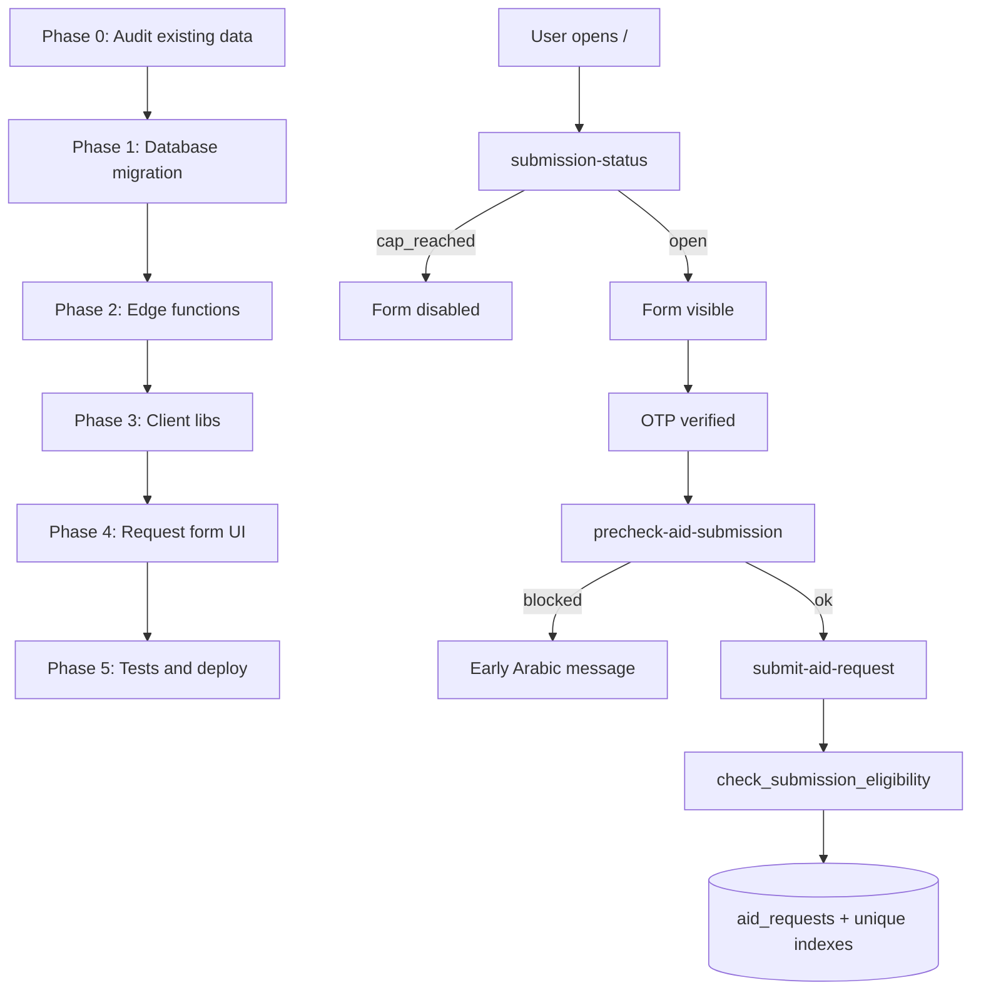

# Submission Limits — Phased Implementation Plan

**Project:** SANAD Aid Connect  
**Feature:** One submission per phone / device / IP + 50 requests per day  
**Updated:** 2026-06-06  
**Status:** Planning — do not implement out of phase order

This document splits the submission-uniqueness work into **five phases**. Each phase lists **file specs** (rules you must read and satisfy **before** editing that file). Phases are sequential unless marked otherwise.

---

## Policy (locked)

| Rule | Behavior |
|------|----------|
| Phone | **One submission ever** per normalized Lebanese phone. No resubmit even if admin rejected. |
| Device | **One submission ever** per `device_fingerprint`. |
| IP | **One submission ever** per `ip_hash`. Skip weak/unknown hashes (e.g. `ip_0`). |
| Daily cap | **50 new `aid_requests` per calendar day** in timezone `Asia/Beirut`. |
| Cap UX | When cap is reached, **disable/hide the entire public form** on page load (not only at submit). |
| Rejected resubmit | **Never** — same as any other prior submission. |

---

## Architecture overview



---

## Phase 0 — Pre-flight audit (no feature code yet)

**Goal:** Ensure production/staging data will not break unique indexes. Identify duplicate phones, devices, and IPs before migration.

**Duration:** ~30 minutes manual + one SQL script run in Supabase SQL Editor.

### Tasks

1. Run duplicate audit queries on `aid_requests` (see [Appendix A](#appendix-a-pre-migration-audit-sql)).
2. Decide cleanup for each duplicate group (keep oldest row, mark others — **do not delete without client approval**).
3. Confirm Supabase project ref matches deploy target (`lpdjtzwfxsjjudhxinmk` or staging).
4. Confirm edge function `submit-aid-request` is the **only** insert path (`REVOKE INSERT` already applied in `20260607160000_aid_request_ip_hash.sql`).

### Exit criteria

- [ ] Zero duplicate `phone_normalized` values OR documented cleanup plan approved
- [ ] Zero duplicate `device_fingerprint` (non-null) OR documented cleanup
- [ ] Zero duplicate `ip_hash` (non-null, not `ip_0`) OR documented cleanup
- [ ] Stakeholder sign-off on strict IP rule (shared WiFi = second person blocked)

### Files in this phase

| File | Action |
|------|--------|
| None in repo | SQL run in Supabase dashboard only |
| This doc | Check off Phase 0 exit criteria |

---

## Phase 1 — Database layer

**Goal:** Add normalized phone, eligibility RPCs, daily status RPC, and unique indexes.

**Depends on:** Phase 0 complete.

### Migration file spec

**File to create:** `supabase/migrations/20260608120000_submission_uniqueness_and_daily_cap.sql`

#### Rules before implementing this file

1. **Naming:** Timestamp must be after latest migration in `supabase/migrations/`.
2. **Idempotent patterns:** Use `ADD COLUMN IF NOT EXISTS`, `CREATE OR REPLACE FUNCTION`, `DROP ... IF EXISTS` where safe.
3. **Phone normalization:** Must match edge function logic in `submit-aid-request/index.ts`:
   - Strip non-digits
   - If starts with `961`, keep; if starts with `0`, replace with `961`; else use digits as-is
4. **Do not** add RLS policies that re-enable anon `INSERT` on `aid_requests`.
5. **Do not** change scoring functions unless required for `phone_normalized` trigger compatibility.
6. **Daily limit:** Constant `50` in SQL (`daily_submission_limit()` helper or inline). Timezone: `Asia/Beirut`.
7. **Unique indexes:** Create only after backfill completes in same migration transaction.
8. **Grant pattern:** Match existing security model — eligibility RPCs `service_role` only; status RPC `anon` + `authenticated` read-only.

#### Must implement

| Item | Detail |
|------|--------|
| Column | `aid_requests.phone_normalized TEXT` |
| Backfill | `UPDATE aid_requests SET phone_normalized = normalize_phone(phone)` |
| Trigger | `BEFORE INSERT OR UPDATE OF phone` → set `phone_normalized` |
| Function | `normalize_phone(raw TEXT) RETURNS TEXT` — immutable, SQL or plpgsql |
| Index | `UNIQUE (phone_normalized)` |
| Index | `UNIQUE (device_fingerprint) WHERE device_fingerprint IS NOT NULL` |
| Index | `UNIQUE (ip_hash) WHERE ip_hash IS NOT NULL AND ip_hash <> 'ip_0'` |
| RPC | `get_submission_status()` → JSONB `{ accepting, daily_count, daily_limit, message_ar }` |
| RPC | `check_submission_eligibility(_phone, _device_fp, _ip_hash)` → JSONB `{ allowed, reason, message_ar, existing_reference_code? }` |

#### `check_submission_eligibility` reason codes (exact strings)

- `daily_cap_reached`
- `phone_already_submitted`
- `device_already_submitted`
- `ip_already_submitted`
- `allowed` (when `allowed: true`, `reason` may be null)

#### Check order inside RPC

1. Daily cap (`get_submission_status`)
2. Phone (match on `phone_normalized`)
3. Device fingerprint
4. IP hash

#### Exit criteria

- [ ] Migration applies cleanly on empty duplicate dataset
- [ ] `SELECT get_submission_status()` returns valid JSON from SQL Editor
- [ ] `SELECT check_submission_eligibility(...)` callable as `service_role`
- [ ] Regenerate types: `npm run types:gen` (after apply)

### File spec: `src/integrations/supabase/types.ts`

#### Rules before editing

1. **Do not hand-edit** — regenerate via `npm run types:gen` after migration is applied to linked project.
2. Only commit type changes that reflect new RPCs/columns.

---

## Phase 2 — Edge functions

**Goal:** Server-side enforcement and public status endpoint.

**Depends on:** Phase 1 migration applied to Supabase.

### Shared CORS / helpers spec

**Pattern source:** Copy CORS + `jsonWithCors` from existing [`supabase/functions/submit-aid-request/index.ts`](supabase/functions/submit-aid-request/index.ts) — do not invent a new CORS scheme.

**Shared rule:** All three functions return JSON `{ ok: boolean, ... }` for client parsing consistency.

---

### File spec: `supabase/functions/submission-status/index.ts` (NEW)

#### Rules before implementing

1. **Methods:** `GET` or `POST` only; handle `OPTIONS` preflight.
2. **Auth:** Uses **service role** internally; callable by **anon** via Supabase Functions invoke (no user JWT required).
3. **No PII:** Response must not include phone numbers, names, or request lists.
4. **Do not** call `check_submission_eligibility` — only `get_submission_status()`.
5. **Errors:** 500 with generic Arabic message on RPC failure; never leak stack traces.

#### Response shape

```json
{
  "ok": true,
  "accepting": true,
  "daily_count": 12,
  "daily_limit": 50,
  "message_ar": null
}
```

When cap reached, `accepting: false` and `message_ar` set (see [Appendix B — Arabic copy](#appendix-b-arabic-user-messages)).

#### Exit criteria

- [ ] `curl`/invoke returns status without auth
- [ ] Works from Netlify production origin (CORS)

---

### File spec: `supabase/functions/precheck-aid-submission/index.ts` (NEW)

#### Rules before implementing

1. **Method:** `POST` only.
2. **Requires:** Recent OTP verification for phone (reuse `hasRecentPhoneVerification` — extract to shared module OR duplicate minimally with same 24h window).
3. **Body:** `{ phone: string, device_fingerprint?: string | null }`.
4. **Server derives:** `ip_hash` from `x-forwarded-for` (same hash function as submit).
5. **Calls:** `check_submission_eligibility` via service role RPC.
6. **Do not** insert rows — read-only check.
7. **Do not** expose whether phone exists **without** verified OTP (return 403 same as submit OTP gate).

#### Response shape

```json
{
  "ok": true,
  "allowed": false,
  "reason": "phone_already_submitted",
  "message": "...",
  "existing_reference_code": "SND-XXXXX"
}
```

`existing_reference_code` only when `reason === phone_already_submitted`.

#### Exit criteria

- [ ] Blocked when OTP missing
- [ ] Returns early block after OTP for duplicate phone
- [ ] No enumeration without OTP

---

### File spec: `supabase/functions/submit-aid-request/index.ts` (EDIT)

#### Rules before implementing

1. **Read the full file first** — preserve OTP gate, CORS, and insert field list.
2. **Add before insert:**
   - Call `check_submission_eligibility(phone, device_fingerprint, ip_hash)`
   - If `allowed === false` → return **409** with `{ ok: false, reason, message }`
3. **Set on insert:** `phone_normalized` via DB trigger OR explicit field (prefer trigger-only to avoid drift).
4. **Catch Postgres `23505`:** Map unique violations to same `reason` codes (concurrent double-submit).
5. **Do not** remove existing fields from insert payload.
6. **Do not** change success response shape `{ ok: true, id, reference_code }`.

#### Exit criteria

- [ ] Second submit same phone → 409 + Arabic message
- [ ] Submit when daily cap full → 409 even if form was open (race at 49→50)
- [ ] First submit still returns 200

---

### Optional file spec: `supabase/functions/_shared/submission-eligibility.ts` (NEW)

#### Rules before implementing

1. Only create if duplication between `submit-aid-request` and `precheck-aid-submission` exceeds ~40 lines.
2. Must export: `normalizePhone`, `hashIdentifier`, `hasRecentPhoneVerification`, `checkEligibility(admin, ...)`.
3. Deno-compatible imports only.

---

### File spec: `package.json` (EDIT — deploy scripts only)

#### Rules before editing

1. Add deploy scripts matching existing pattern:
   - `functions:deploy:submission-status`
   - `functions:deploy:precheck-aid-submission`
2. Append to `functions:deploy` chain if present — do not remove existing deploy targets.
3. **Do not** change `build` or `dev` scripts.

---

## Phase 3 — Client libraries

**Goal:** Typed wrappers for new edge functions; extend submit result types.

**Depends on:** Phase 2 functions deployed to Supabase (or local supabase serve for dev).

---

### File spec: `src/lib/submission-status.ts` (NEW)

#### Rules before implementing

1. **Single responsibility:** Fetch public submission openness only.
2. **Use:** `supabase.functions.invoke('submission-status', { method: 'GET' })` or POST with empty body — match edge function.
3. **Return type:**

```ts
export type SubmissionStatus = {
  accepting: boolean;
  daily_count: number;
  daily_limit: number;
  message_ar: string | null;
};

export type SubmissionStatusResult =
  | { ok: true; status: SubmissionStatus }
  | { ok: false; message: string };
```

4. **Do not** import React.
5. **Do not** cache longer than page session unless explicit requirement — start with no cache (simplest).

#### Exit criteria

- [ ] Callable from browser with anon key
- [ ] Handles network/invoke errors gracefully

---

### File spec: `src/lib/precheck-aid-submission.ts` (NEW)

#### Rules before implementing

1. **Invoke:** `precheck-aid-submission` with `{ phone, device_fingerprint }`.
2. **Call only after** OTP verified (caller responsibility — do not re-verify OTP here).
3. **Return type** includes `reason` union matching server codes.
4. **Do not** throw on blocked — return `{ ok: true, allowed: false, ... }`.

#### Exit criteria

- [ ] Maps all four block reasons
- [ ] Surfaces `existing_reference_code` when present

---

### File spec: `src/lib/submit-aid-request.ts` (EDIT)

#### Rules before implementing

1. **Extend** `AidRequestSubmitResult` failure branch:

```ts
| { ok: false; message: string; reason?: SubmissionBlockReason }
```

2. **Export** `SubmissionBlockReason` type shared with precheck (single source in `src/lib/submission-limits-types.ts` OR inline in submit file — prefer small shared file if both import).
3. **Pass through** `reason` from edge response when present.
4. **Do not** change success path or payload shape to edge function.

---

### File spec: `src/lib/submission-limits-types.ts` (NEW, optional but recommended)

#### Rules before implementing

1. Export `SubmissionBlockReason` union type only — no runtime logic.
2. Keep in sync with SQL reason codes in Phase 1.

---

## Phase 4 — Request form UI

**Goal:** Page-load cap gate, post-OTP precheck, improved error UX.

**Depends on:** Phase 3 libs.

---

### File spec: `src/routes/index.tsx` (EDIT)

#### Rules before implementing

1. **Read** `RequestHome` component fully — match existing patterns for `submitError`, loading states, RTL Arabic.
2. **On mount:** Call `fetchSubmissionStatus()` once.
3. **If `!accepting`:** Render closed-state UI instead of `<form>`:
   - Arabic message from server (`message_ar`)
   - Link to `/track`
   - Optional: show `daily_count / daily_limit`
4. **Do not** remove hero section or `PublicNav`/`PublicFooter` — only replace form area.
5. **After OTP verified** (in `PhoneOtpSection` callback or parent state when `phoneVerified` becomes true):
   - Call `precheckAidSubmission(phone, deviceFingerprint)`
   - Store result in state e.g. `eligibilityBlock`
   - If blocked, show persistent alert; disable submit button
6. **On submit:** Existing flow unchanged except display `reason`-specific CTAs:
   - `phone_already_submitted` → link to `/track` with hint to use reference code
7. **Do not** add new routes.
8. **Do not** change validation schema for form fields unrelated to limits.

#### UI states (must implement all)

| State | UI |
|-------|-----|
| `statusLoading` | Skeleton or spinner in form area |
| `capClosed` | Full form replacement message |
| `eligibilityBlock` | Amber/destructive alert above form sections |
| `submitError` | Existing banner (keep) |

#### Exit criteria

- [ ] At 50 submissions today, visitor sees closed form without filling anything
- [ ] Duplicate phone after OTP shows message before step 7 of form
- [ ] Submit button disabled when `eligibilityBlock` set

---

### File spec: `src/components/PhoneOtpSection.tsx` (EDIT — minimal)

#### Rules before implementing

1. **Prefer** parent-driven precheck (index.tsx) via `onVerifiedChange` — only edit this file if a callback hook is needed.
2. If editing: add optional `onVerified?: () => void` — **do not** break existing props.
3. **Do not** import submission libs here unless unavoidable.

---

## Phase 5 — Tests, types, deploy

**Goal:** Automated coverage and safe production rollout.

**Depends on:** Phases 1–4 complete.

---

### File spec: `src/lib/__tests__/submission-status.integration.test.ts` (NEW)

#### Rules before implementing

1. Follow pattern in [`src/lib/__tests__/submit-aid-request.integration.test.ts`](src/lib/__tests__/submit-aid-request.integration.test.ts).
2. Mock `supabase.functions.invoke`.
3. Cases: accepting open, cap closed, invoke error.

---

### File spec: `src/lib/__tests__/precheck-aid-submission.integration.test.ts` (NEW)

#### Rules before implementing

1. Mock invoke responses for each `reason`.
2. Assert `existing_reference_code` passed through for phone block.

---

### File spec: `src/lib/__tests__/submit-aid-request.integration.test.ts` (EDIT)

#### Rules before implementing

1. Add cases for 409-style responses with `reason` field.
2. **Do not** remove existing passing tests.

---

### File spec: `supabase/migrations/20260608120000_submission_uniqueness_and_daily_cap.sql` (verification)

#### Manual SQL tests (SQL Editor)

1. First eligibility check → `allowed: true`
2. Insert one row → second check same phone → `phone_already_submitted`
3. Count 50 rows today → `get_submission_status.accepting = false`

---

### Deploy order (strict)

| Step | Action |
|------|--------|
| 1 | Phase 0 audit + cleanup |
| 2 | Apply migration (Phase 1) |
| 3 | `npm run types:gen` |
| 4 | Deploy edge functions (Phase 2) |
| 5 | Merge & deploy frontend (Phases 3–4) |
| 6 | Smoke test production `/` |

### Post-deploy smoke checklist

- [ ] Fresh phone → submit succeeds
- [ ] Same phone → blocked with Arabic message
- [ ] `/track` link works from blocked state
- [ ] Form hidden when daily cap simulated (staging)

---

## Appendix A — Pre-migration audit SQL

Run in Supabase SQL Editor before Phase 1:

```sql
-- Duplicate phones (normalized)
SELECT
  regexp_replace(phone, '[^0-9]', '', 'g') AS phone_norm,
  COUNT(*) AS cnt,
  array_agg(reference_code ORDER BY created_at) AS codes
FROM aid_requests
GROUP BY 1
HAVING COUNT(*) > 1;

-- Duplicate device fingerprints
SELECT device_fingerprint, COUNT(*)
FROM aid_requests
WHERE device_fingerprint IS NOT NULL
GROUP BY 1
HAVING COUNT(*) > 1;

-- Duplicate IP hashes (exclude unknown)
SELECT ip_hash, COUNT(*)
FROM aid_requests
WHERE ip_hash IS NOT NULL AND ip_hash <> 'ip_0'
GROUP BY 1
HAVING COUNT(*) > 1;

-- Today's count (Beirut)
SELECT COUNT(*) AS today_count
FROM aid_requests
WHERE created_at >= (date_trunc('day', now() AT TIME ZONE 'Asia/Beirut') AT TIME ZONE 'Asia/Beirut');
```

---

## Appendix B — Arabic user messages

| Code | Arabic message |
|------|----------------|
| `daily_cap_reached` (page) | نعتذر — وصلنا إلى الحد اليومي لاستقبال الطلبات (٥٠ طلباً). سنعود لاستقبال طلبات جديدة غداً. إذا قدّمت طلباً سابقاً، يمكنك متابعته من [صفحة التتبّع](/track). |
| `phone_already_submitted` | سبق أن قدّمت طلباً من هذا الرقم. يُسمح بطلب واحد فقط لكل رقم هاتف. |
| `device_already_submitted` | سبق أن قُدّم طلب من هذا الجهاز. يُسمح بطلب واحد فقط لكل جهاز. |
| `ip_already_submitted` | سبق أن قُدّم طلب من هذا الاتصال. يُسمح بطلب واحد فقط. |
| Generic fallback | تعذّر إرسال الطلب. يرجى التواصل معنا إذا كنت تعتقد أن هذا خطأ. |

When `phone_already_submitted` and `existing_reference_code` is known, append:

> رقمك المرجعي: `{code}` — استخدمه في صفحة التتبّع.

---

## Appendix C — File checklist (all phases)

| File | Phase | Create / Edit |
|------|-------|---------------|
| `supabase/migrations/20260608120000_submission_uniqueness_and_daily_cap.sql` | 1 | Create |
| `src/integrations/supabase/types.ts` | 1 | Regenerate |
| `supabase/functions/submission-status/index.ts` | 2 | Create |
| `supabase/functions/precheck-aid-submission/index.ts` | 2 | Create |
| `supabase/functions/submit-aid-request/index.ts` | 2 | Edit |
| `supabase/functions/_shared/submission-eligibility.ts` | 2 | Create (optional) |
| `package.json` | 2 | Edit (deploy scripts) |
| `src/lib/submission-limits-types.ts` | 3 | Create |
| `src/lib/submission-status.ts` | 3 | Create |
| `src/lib/precheck-aid-submission.ts` | 3 | Create |
| `src/lib/submit-aid-request.ts` | 3 | Edit |
| `src/routes/index.tsx` | 4 | Edit |
| `src/components/PhoneOtpSection.tsx` | 4 | Edit (minimal, if needed) |
| `src/lib/__tests__/submission-status.integration.test.ts` | 5 | Create |
| `src/lib/__tests__/precheck-aid-submission.integration.test.ts` | 5 | Create |
| `src/lib/__tests__/submit-aid-request.integration.test.ts` | 5 | Edit |

---

## Appendix D — What NOT to change

- Scoring/trust algorithms (unless migration trigger conflict — unlikely)
- Admin queue, export, or track pages (except `/track` link from error UI)
- Donation rate limits (separate system)
- RLS that would re-open direct `aid_requests` INSERT to anon
- `.env` secrets committed to git

---

## Implementation log (fill as you go)

| Phase | Date | By | Notes |
|-------|------|-----|-------|
| 0 | | | |
| 1 | | | |
| 2 | | | |
| 3 | | | |
| 4 | | | |
| 5 | | | |

---

*End of phased plan. Implement one phase at a time; check exit criteria before starting the next.*
